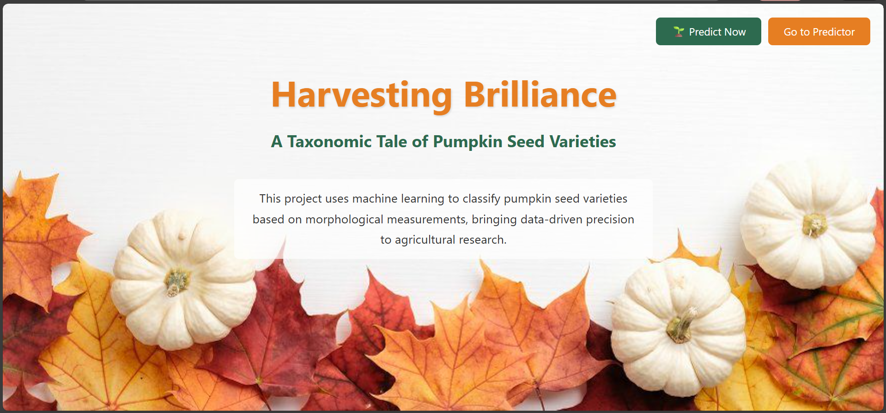
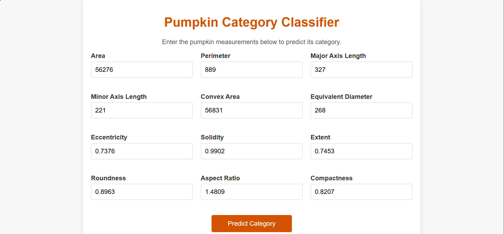
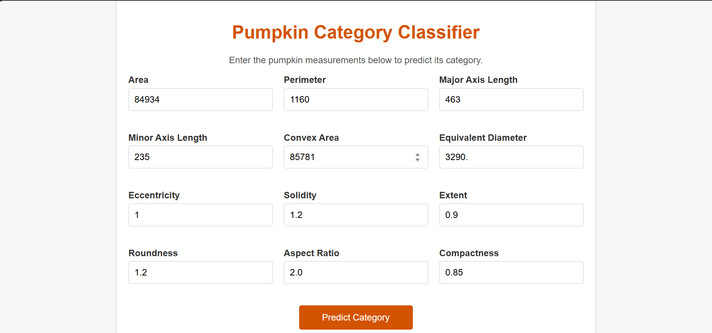
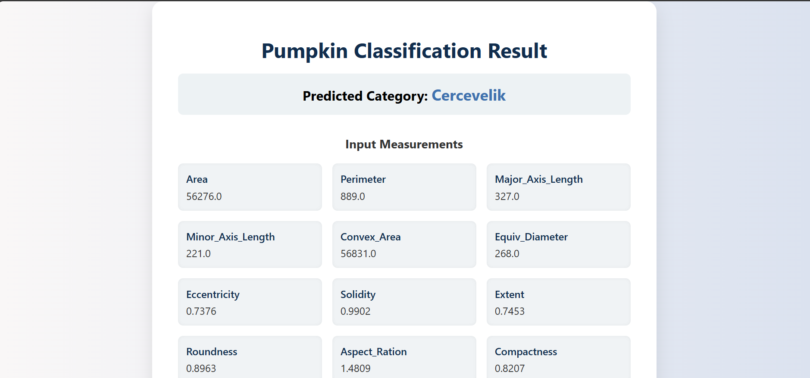
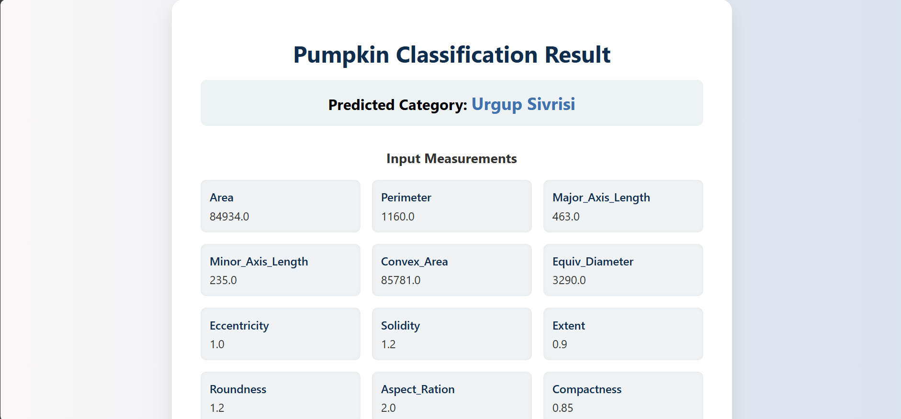

# Harvesting Brilliance: A Taxonomic Tale of Pumpkin Seed Varieties

## Project Overview

**Harvesting Brilliance** is a machine learning based web application that classifies pumpkin seed varieties using morphological measurements.  
The system takes numerical features such as Area, Perimeter, Major Axis Length, Minor Axis Length, and other shape-based properties as input and predicts the **category of pumpkin seed variety**.

---

## How to Run

1. Install requirements:
   pip install -r requirements.txt

2. Run project:
   python app.py

## Project Screenshots

### Home Page

### Prediction Page

### Result Page

## 👨‍💻 Developed By

Ankita Dinde